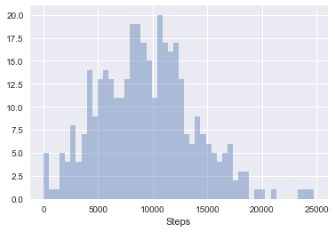

# I. Exploratory Data Analysis
**by: Duke LeTran**

**date: Fri, February 2nd, 2018**


```python
#Initialize Libraries
import numpy as np
import pandas as pd
import calendar as cal

df = pd.read_csv('datasets/ErinsFitbit2016.csv')

#other misc set-up
ls_month = []
for i in cal.month_name:
    if len(i) == 0:
        continue
    else:
        ls_month.append(i[0:3])
```


## Question 1

A Fitbit tracker is used to track various data on sleep, and steps. Online you will find the dataset ErinsFitbit2016.csv. This is my Fitbit data for the year 2016. It has the following columns:


|Column | Variable | Description |
|:-----:|:--------:|:-----------:|
| 1     | Month    | The month the data was recorded.|
| 2     | Day      | The day of the week the data was |
| 3     | Steps    | The total number of steps taken for that day |
| 4     | Miles    | The total distance walked in miles for that day |
| 5     | Floors   | The total number of flights of stairs climbed in that day (or the equivalent hill, etc) |
| 6     | Sed      | The total number of “low activity” hours for that day |
| 7     | Active   | The total number of “active” hours for that day |
| 8     | Sleep    | The total number of hours of sleep for the previous night |


```python
for i,j in enumerate(df.columns.tolist()):
    print(i,j)
```

    0 Month
    1 Day
    2 Steps
    3 Miles
    4 Floors
    5 Sed
    6 Active
    7 Sleep


### a) Find the overall average for hours of sleep.


```python
df['Sleep'].mean()
```


    7.6122677595628421


### b) Find the overall variance for hours of sleep.


```python
df['Sleep'].var()
```


    1.3107677198892134


### c) Find the overall five number summary for the “active” hours.


```python
df['Active'].describe() #gives you a little more than the five numbers
```


    count    366.000000
    mean       4.897623
    std        1.653184
    min        0.000000
    25%        3.740000
    50%        5.055000
    75%        6.070000
    max       10.200000
    Name: Active, dtype: float64


### d) Find the number of days per month


```python
df.groupby('Month')['Day'].count().reindex(index=ls_month)
```


    Month
    Jan    31
    Feb    29
    Mar    31
    Apr    30
    May    31
    Jun    30
    Jul    31
    Aug    31
    Sep    30
    Oct    31
    Nov    30
    Dec    31
    Name: Day, dtype: int64


## Question 2


```python
#init list for question 2
ls_day = ['Sun', 'Mon', 'Tue', 'Wed', 'Thu', 'Fri', 'Sat']
```

### a) Find the average hours of sleep for every day of the week. Is there a particular day where I got more sleep in 2016? If so, which one was it?


```python
df.groupby('Day')['Sleep'].mean().reindex(index=ls_day)
```


    Day
    Sun    7.662500
    Mon    7.200385
    Tue    7.894615
    Wed    7.385577
    Thu    7.643077
    Fri    7.630566
    Sat    7.863962
    Name: Sleep, dtype: float64


### b) Find the average number of steps for every day of the week. Are there particular days where I stepped more in 2016? If so, which are they?


```python
df.groupby('Day')['Steps'].mean().reindex(index=ls_day)
```


    Day
    Sun     6030.884615
    Mon    11351.519231
    Tue     9518.153846
    Wed    10792.711538
    Thu     8771.326923
    Fri    11370.377358
    Sat     8117.886792
    Name: Steps, dtype: float64


### c) Find the variance of hours of sleep by month. Which month has the highest variance? Which the lowest?


```python
df.groupby('Month')['Sleep'].var().reindex(index=ls_month)
```


    Month
    Jan    1.662749
    Feb    2.588058
    Mar    0.927096
    Apr    0.538976
    May    0.767363
    Jun    1.288700
    Jul    3.155800
    Aug    2.589669
    Sep    0.558120
    Oct    0.729238
    Nov    0.435710
    Dec    0.598136
    Name: Sleep, dtype: float64


### d) Find the standard deviation for the hours of “low activity” days by month. Do you believe there is a month that stands out in some way? Explain.


```python
df.groupby('Month')['Sed'].std().reindex(index=ls_month)
```


    Month
    Jan    2.007835
    Feb    0.973584
    Mar    2.086754
    Apr    1.172028
    May    1.094034
    Jun    1.563836
    Jul    1.896349
    Aug    1.400490
    Sep    1.166336
    Oct    2.191055
    Nov    1.304348
    Dec    3.759295
    Name: Sed, dtype: float64


## Question 3


```python
%matplotlib inline
import matplotlib.pyplot as plt
import seaborn as sns
sns.set()
```

### a) Make an overall histogram of the number of steps. Does this graph seem skewed?


```python
#regular matplotlib
plt.hist(df['Steps'], normed=True, alpha = 0.5)
```


    (array([  1.76558348e-05,   4.63465664e-05,   6.84163599e-05,
              9.15896431e-05,   8.93826637e-05,   4.63465664e-05,
              2.86907316e-05,   9.93140708e-06,   2.20697935e-06,
              3.31046903e-06]),
     array([     0.,   2476.,   4952.,   7428.,   9904.,  12380.,  14856.,
             17332.,  19808.,  22284.,  24760.]),
     <a list of 10 Patch objects>)


```python
#seaborn histogram
sns.distplot(df['Steps'], hist=True, kde=False, bins=50)
```


    <matplotlib.axes._subplots.AxesSubplot at 0x10c3e5160>





### b) oops


```python
sns.boxplot(x=df['Sleep'])
```


    <matplotlib.axes._subplots.AxesSubplot at 0x10c66c748>


### c) Plot a scatterplot of the hours of sleep vs. the number of steps overall. Does there appear to be any pattern in this plot? Explain.


```python
from ggplot import *
ggplot(df, aes(x='Sleep', y='Steps'))\
      + geom_point() #not ggplot style, but more python
```


    <ggplot: (-9223372036572570389)>


d) Plot a barplot of the frequency of the days. Does this look as you would expect? Explain.


```python
s_freq_days = df.groupby('Day')['Miles'].count().reindex(index=ls_day)
df_freq_days = pd.DataFrame(s_freq_days)
df_freq_days = df_freq_days.rename(columns={'Miles':'day_freq'})
df_freq_days.reset_index(inplace=True)
sns.barplot(x='Day', y='day_freq', palette='Blues_d', data=df_freq_days)
```


    <matplotlib.axes._subplots.AxesSubplot at 0x10d2fd2b0>


## Question 4

### a) Plot a grouped boxplot of steps by the day of the week. Which day had the least steps (if any)?


```python
sns.boxplot(x='Day', y='Steps', data=df)
```


    <matplotlib.axes._subplots.AxesSubplot at 0x10d70bc18>


### b) Plot a grouped boxplot of sleep by the month of the year. Which month had the largest spread (if any)?


```python
sns.boxplot(x='Month', y='Sleep', data=df)
```


    <matplotlib.axes._subplots.AxesSubplot at 0x10d686f60>


### c) Plot a grouped boxplot of active hours by day. Are there a group of days that appear to be more active? If so, which ones?


```python
sns.boxplot(x='Day', y='Active', data=df)
```


    <matplotlib.axes._subplots.AxesSubplot at 0x10e9682b0>


### d) Plot a grouped histogram of “low activity” by day. Which day has the lowest “low activity” hours?


```python
#matplotlib alone (ugly)
df['Sed'].hist(by=df['Day'])
```


    array([[<matplotlib.axes._subplots.AxesSubplot object at 0x1104823c8>,
            <matplotlib.axes._subplots.AxesSubplot object at 0x11059c748>,
            <matplotlib.axes._subplots.AxesSubplot object at 0x1105bac88>],
           [<matplotlib.axes._subplots.AxesSubplot object at 0x1105292e8>,
            <matplotlib.axes._subplots.AxesSubplot object at 0x1105c2e48>,
            <matplotlib.axes._subplots.AxesSubplot object at 0x1105e0898>],
           [<matplotlib.axes._subplots.AxesSubplot object at 0x11076ae48>,
            <matplotlib.axes._subplots.AxesSubplot object at 0x1107914a8>,
            <matplotlib.axes._subplots.AxesSubplot object at 0x1107b8048>]], dtype=object)


```python
df.groupby('Month')['Sed'].max()
```


    Month
    Apr    12.85
    Aug    13.68
    Dec    24.00
    Feb    13.63
    Jan    17.72
    Jul    18.27
    Jun    15.28
    Mar    20.52
    May    13.12
    Nov    14.30
    Oct    17.20
    Sep    14.42
    Name: Sed, dtype: float64


```python
#sns and matplotlib together makes a much nicer "grouped histogram"
g = sns.FacetGrid(df, col='Month')
g = g.map(plt.hist, 'Sed', bins=np.arange(min(df['Sed']),max(df['Sed']) + 0.5, 0.5))
```


