Topic I: Transformation of Variables
================
Duke LeTran
November 27th, 2017

I. Original Data
================

This report aims analyze the dataset (n = 113) "transform1.csv," which consists of X and Y.

A. Summary of Data
------------------

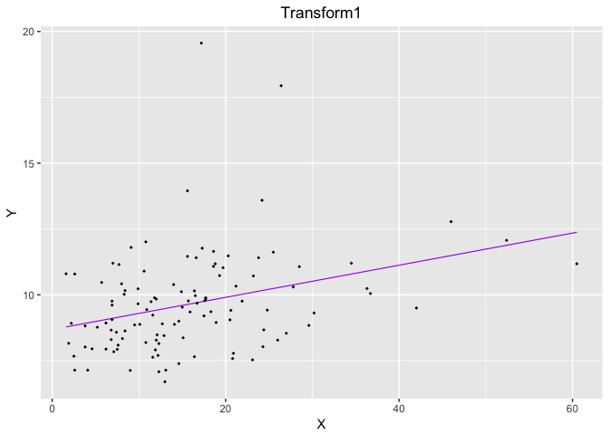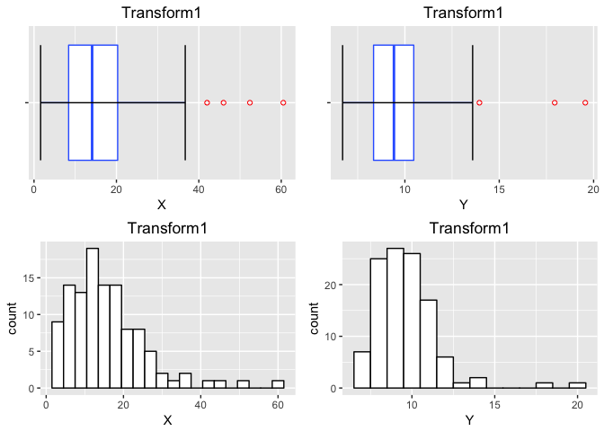

From a cursory glance at the respective boxplots and histograms of X and Y, we see that the data seems to be right skewed. The distribution of X perhaps may not be wholely informative of the linearity of the data, but perhaps it suggests that we should not fully trust any predictions made towards higher values of our dataset due to lack of information. This is further evidenced by the scatterplot which demonstrates a lack of density in data points towards higher values of X.

The right-skew of the Y distribution (as seen in the boxplots and histograms) may suggest outliers, in which we can observe the scatterplot (high data points near X = 20), the box plot of Y (two of the three red dots), and the histogram of Y (two data points in the right tail) as the two data points with values of Y higher than 15.

Let us further confirm with a few diagnostics.

B. Diagnostics
--------------

#### Assessing Linearity between X and Y

Based on our raw data, our estimated regression line is:

*Y* = 8.68476 + 0.06101*X*

*Confidence Interval of *β*<sub>1</sub>*

We are 99% confident that that when X changes by 1 unit, the estimated change of Y increases, on average, between 0.0171023 and 0.1049221. Since zero is not included in the Confidence Interval of *β*<sub>1</sub> and is strictly positive, a statistically significant positive relationship is suggested between Y and X.

*Hypothesis Testing of *β*<sub>1</sub>*

*H*<sub>0</sub>: There is no significant positive linear relationship between Y and X

*H*<sub>*A*</sub>: There is a significant positive linear relationshp between Y and X

Assuming that the null is true, our data or more extreme has the probability 2.066100310^{-4} which is less than *α* = 0.01. Thus, we reject the null hypothesis and accept the alternative hypothesis that there is a significant positive linear relationship.

#### Assessing Assumption 1: Normality

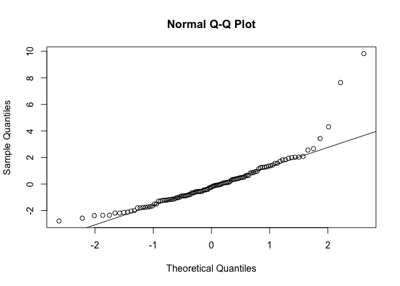

##### Shaprio-Wilks

*H*<sub>0</sub>: The errors are normally distributed

*H*<sub>*A*</sub>: The errors are NOT normally distributed

Since our data or more extreme has the probability of 1.403366710^{-9} or more extreme, our data for the Shapiro-Wilks Test has rejected the null hypothesis for *α* = 0.05, and so we accept the alternative hypothesis that our data is non-normal.

#### Assessing Assmption 2: Constant Variance (Homoscedasticity)

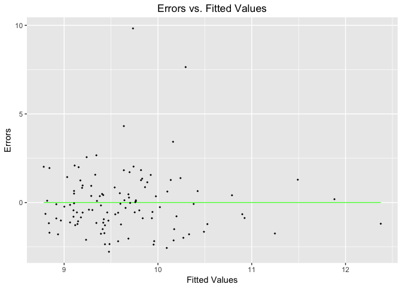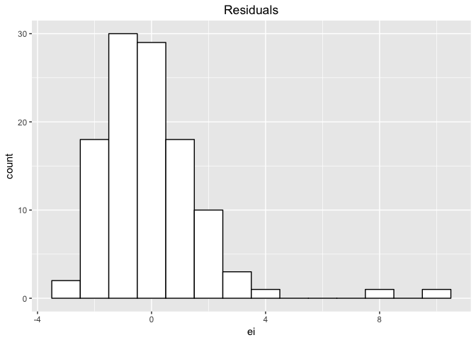

##### Fligner-Killen (FK) Test

*H*<sub>0</sub> : *σ*<sub>*l**o**w**e**r*</sub><sup>2</sup> = *σ*<sub>*u**p**p**e**r*</sub><sup>2</sup>

*H*<sub>0</sub> : *σ*<sub>*l**o**w**e**r*</sub><sup>2</sup> ≠ *σ*<sub>*u**p**p**e**r*</sub><sup>2</sup>

Since our data or more extreme has the probability of 0.0340876 or more extreme, our data for the Fligner-Killen Test has rejected the null hypothesis for *α* = 0.05, and so we accept the alternative hypothesis that our our data does not maintain constant variance.

### Summary: Original Data

##### Assessing Normality

I. QQPlot - FAIL (outliers present)

1.  SW - FAIL (rejected H0)

##### Assessing Constant Variance

1.  Scatterplot: ei vs Fitted Values - FAIL (outliers present)

2.  Histogram of ei - FAIL (right skewed; outliers present)

3.  FK - FAIL (rejected H0)

II. Removing Outliers and Transformation
========================================

Introduction - 3 possible cases
-------------------------------

For this section, we will apply the following changes to our data to see if it improves the linearity between X and Y. Diagnostics will be performed of each case, and at the end of the section, we will state which case consists of the "best" combination of transformed variables.

-   Case 1: Remove outliers only

-   Case 2: Remove outliers and utilize the Box-Cox transformation method

-   Case 3: Remove outliers and utilize the Tukey transformation method

Case 1: Removing Outliers Only
------------------------------

Based on the exploratory data and diagnostics, we see very two very distinct outliers based on the scatterplot of Y vs. X (purple), qqplot, the scatterplot of errors vs. fitted values (green), and the histogram of ei. For this reason, let's first remove these two points to determine if the linear relationship improves.

Utilizing the scatterplot Errors vs. Fitted Values, we define the cutoff to outliers to be ei &gt; 5.0 or ei &lt; 5.0.

### Case 1: Summary of Data

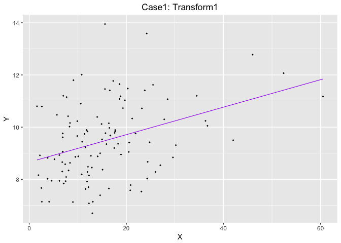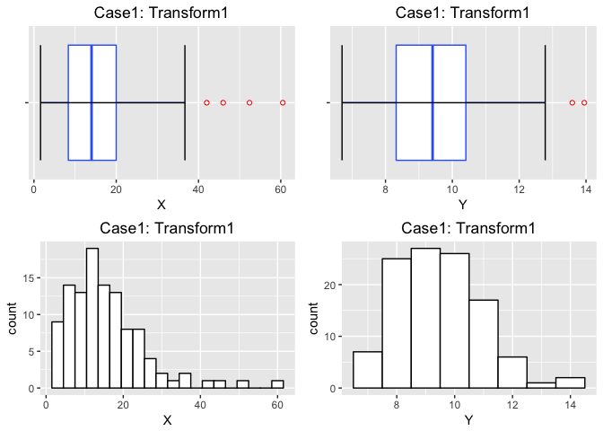

We immediately see improvement in our scatterplots, boxplots, and histograms. Scatterplot is not affected by outliers, boxplots show reduced number of outliers, and histograms decreased in skewness, though let us first continue to the diagnostic tests.

### Case 1: Diagnostics

#### Assessing Linearity between X and Y

Based on our data with outliers removed, our estimated regression line is:

*Y* = 8.6580755 + 0.0526787*X*

*Confidence Interval of *β*<sub>1</sub>*

We are 99% confident that that when X changes by 1 unit, the estimated change of Y increases, on average, between 0.0191576 and 0.0861998. Since zero is not included in the Confidence Interval of *β*<sub>1</sub> and is strictly positive, a statistically significant positive relationship is suggested between Y and X.

*Hypothesis Testing of *β*<sub>1</sub>*

*H*<sub>0</sub>: There is no significant positive linear relationship between Y and X

*H*<sub>*A*</sub>: There is a significant positive linear relationshp between Y and X

Assuming that the null is true, our data or more extreme has the probability 3.702676710^{-5} which is less than *α* = 0.01. Thus, we reject the null hypothesis and accept the alternative hypothesis that there is a significant positive linear relationship.

#### Assessing Assumption 1: Normality

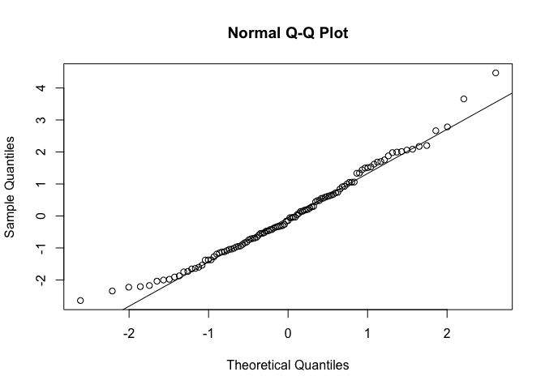

##### Shaprio-Wilks

*H*<sub>0</sub>: The errors are normally distributed

*H*<sub>*A*</sub>: The errors are NOT normally distributed

Since our data or more extreme has the probability of 0.0937939 or more extreme, our data for the Shapiro-Wilks Test has **rejected the null** for *α* = 0.05, and so we accept the alternative hypothesis that our our data is **not** normally distributed.

#### Assessing Assmption 2: Constant Variance (Homoscedasticity)

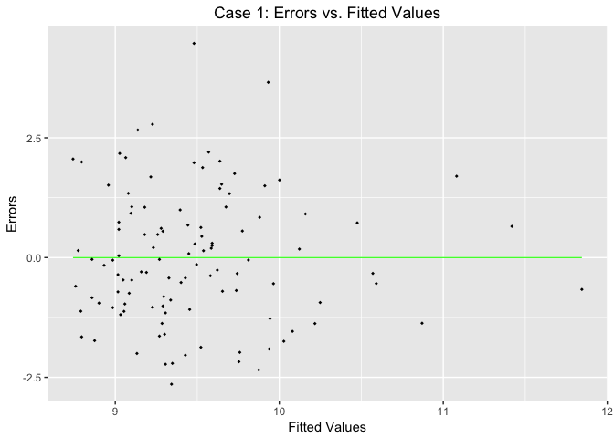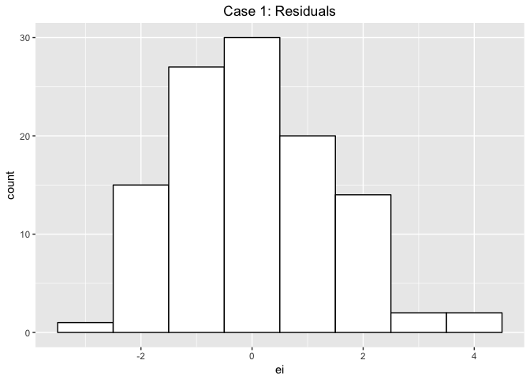

##### Fligner-Killen (FK) Test

*H*<sub>0</sub> : *σ*<sub>*l**o**w**e**r*</sub><sup>2</sup> = *σ*<sub>*u**p**p**e**r*</sub><sup>2</sup>

*H*<sub>0</sub> : *σ*<sub>*l**o**w**e**r*</sub><sup>2</sup> ≠ *σ*<sub>*u**p**p**e**r*</sub><sup>2</sup>

Since our data or more extreme has the probability of 0.0555802 or more extreme, our data for the Fligner-Killen Test has *barely* **failed to reject** the null hypothesis for *α* = 0.05, and so we accept the null hypothesis that our our data maintains constant variance.

### Summary: Outliers Removed

##### Assessing Normality

I. QQPlot - PASS (improved)

1.  SW - FAILED (rejected H0)

##### Assessing Constant Variance

1.  Scatterplot: ei vs Fitted Values - FAILED (improved, reverse cone shaped)

2.  Histogram of ei - PASS (normally distributed)

3.  FK - PASS (improved, barely pass)

Case 2: Remove outliers and utilize the Box-Cox transformation method
---------------------------------------------------------------------

### Case 2: Box-Cox Transformation

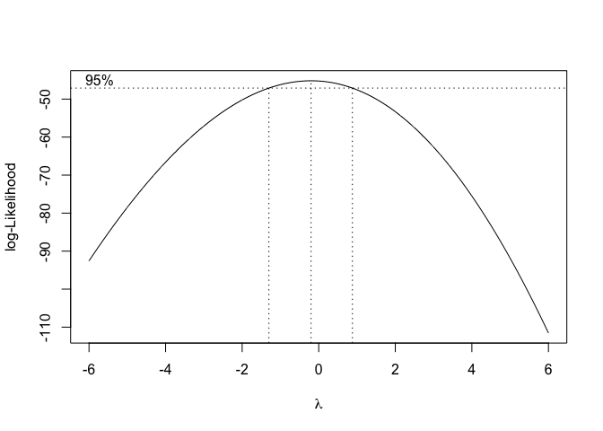

The value of *λ* is -0.2.

### Case 2: Summary of Data

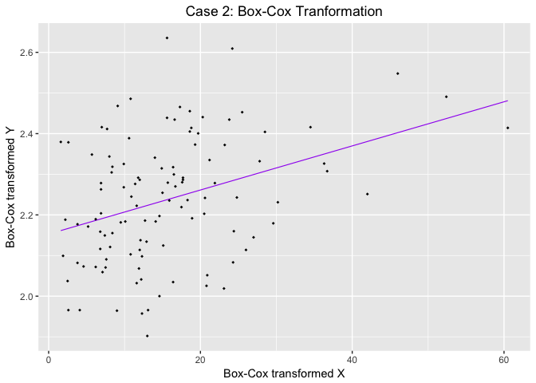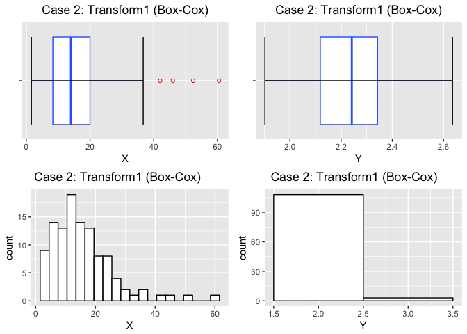

We see that since the Box-Cox Transformation only affects Y, the boxplots and histogram of Y have changed. The boxplot no longer exhibits outliers, and the scale of the transformed Y is different as seen in the histogram (bin size has not been changed). The plots for X remains the same as expected.

### Case 2: Diagnostics

#### Assessing Linearity between X and Y

Based on our Box-Cox transformed data, our estimated regression line is:

*Y* = 2.1527506 + 0.0054266*X*

*Confidence Interval of *β*<sub>1</sub>*

We are 99% confident that that when X changes by 1 unit, the estimated change of Y increases, on average, between 0.0019242 and 0.0089291. Since zero is not included in the Confidence Interval of *β*<sub>1</sub> and is strictly positive, a statistically significant positive relationship is suggested between Y and X.

*Hypothesis Testing of *β*<sub>1</sub>*

*H*<sub>0</sub>: There is no significant positive linear relationship between Y and X

*H*<sub>*A*</sub>: There is a significant positive linear relationshp between Y and X

Assuming that the null is true, our data or more extreme has the probability 4.598538510^{-5} which is less than *α* = 0.01. Thus, we reject the null hypothesis and accept the alternative hypothesis that there is a significant positive linear relationship.

#### Assessing Assumption 1: Normality

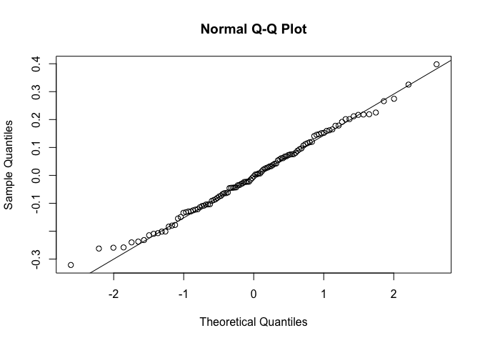

##### Shaprio-Wilks

*H*<sub>0</sub>: The errors are normally distributed

*H*<sub>*A*</sub>: The errors are NOT normally distributed

Since our data or more extreme has the probability of 0.8571313 or more extreme, our data for the Shapiro-Wilks Test has **failed to reject** the null hypothesis for *α* = 0.05, and so we accept the null hypothesis that our our data is normally distributed.

#### Assessing Assmption 2: Constant Variance (Homoscedasticity)

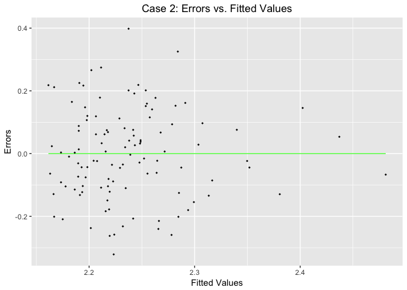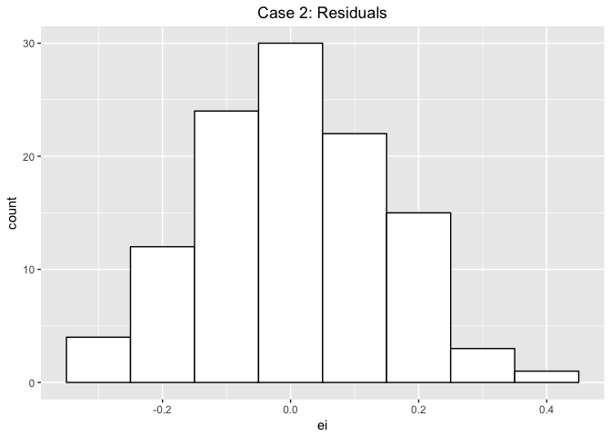

##### Fligner-Killen (FK) Test

*H*<sub>0</sub> : *σ*<sub>*l**o**w**e**r*</sub><sup>2</sup> = *σ*<sub>*u**p**p**e**r*</sub><sup>2</sup>

*H*<sub>0</sub> : *σ*<sub>*l**o**w**e**r*</sub><sup>2</sup> ≠ *σ*<sub>*u**p**p**e**r*</sub><sup>2</sup>

Since our data or more extreme has the probability of 0.5805928 or more extreme, our data for the Fligner-Killen Test has **failed to reject** the null hypothesis for *α* = 0.05, and so we accept the null hypothesis that our data maintains constant variance.

### Summary: Box-Cox Transformation

##### Assessing Normality

I. QQPlot - PASS

1.  SW - PASS

##### Assessing Constant Variance

1.  Scatterplot: ei vs Fitted Values - FAILED (reverse cone)

2.  Histogram of ei - PASS

3.  FK - PASS

Case 3: Remove outliers and utilize the Tukey transformation method
-------------------------------------------------------------------

##### Tukey Transformation

    ## 
    ##     lambda      W Shapiro.p.value
    ## 387  -0.35 0.9904          0.6236
    ## 
    ## if (lambda >  0){TRANS = x ^ lambda} 
    ## if (lambda == 0){TRANS = log(x)} 
    ## if (lambda <  0){TRANS = -1 * x ^ lambda}

    ## 
    ##     lambda      W Shapiro.p.value
    ## 412  0.275 0.9912          0.7005
    ## 
    ## if (lambda >  0){TRANS = x ^ lambda} 
    ## if (lambda == 0){TRANS = log(x)} 
    ## if (lambda <  0){TRANS = -1 * x ^ lambda}

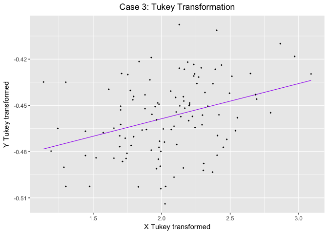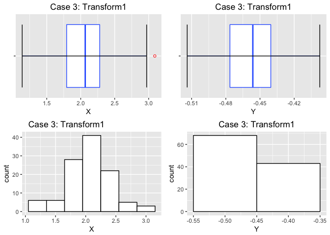

Note in the histogram of Y and histogram of X that the bin values have been respectively reduced from the value of 1.00 to 0.10 and 3.00 to 0.30. Interpretation of this tranformed data is expected to be difficult. We see evidence from the boxplot and histogram of X that X is also now transformed.

### Case 3: Diagnostics

#### Assessing Linearity between X and Y

Based on our Tukey transformed data, our estimated regression line is:

*Y* = −0.5042206 + 0.0227962*X*

*Confidence Interval of *β*<sub>1</sub>*

We are 99% confident that that when X changes by 1 unit, the estimated change of Y increases, on average, between 0.0073474 and 0.038245. Since zero is not included in the Confidence Interval of *β*<sub>1</sub> and is strictly positive, a statistically significant positive relationship is suggested between Y and X.

*Hypothesis Testing of *β*<sub>1</sub>*

*H*<sub>0</sub>: There is no significant positive linear relationship between Y and X

*H*<sub>*A*</sub>: There is a significant positive linear relationshp between Y and X

Assuming that the null is true, our data or more extreme has the probability 9.336197310^{-5} which is less than *α* = 0.01. Thus, we reject the null hypothesis and accept the alternative hypothesis that there is a significant positive linear relationship.

#### Assessing Assumption 1: Normality

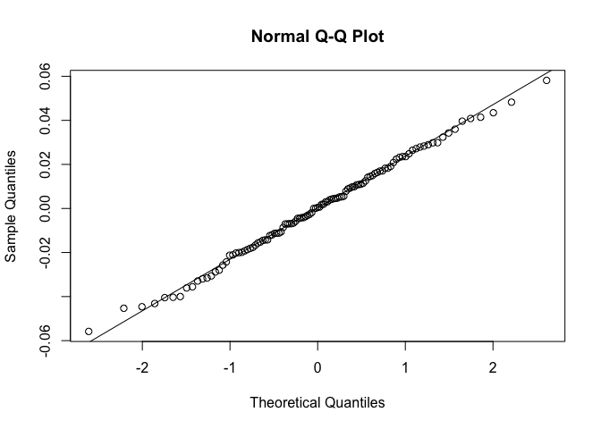

##### Shaprio-Wilks

*H*<sub>0</sub>: The errors are normally distributed

*H*<sub>*A*</sub>: The errors are NOT normally distributed

Since our data or more extreme has the probability of 0.9822563 or more extreme, our data for the Shapiro-Wilks Test has failed to reject the null hypothesis for *α* = 0.05, and so we accept the null hypothesis that our data is normally distributed.

#### Assessing Assmption 2: Constant Variance (Homoscedasticity)

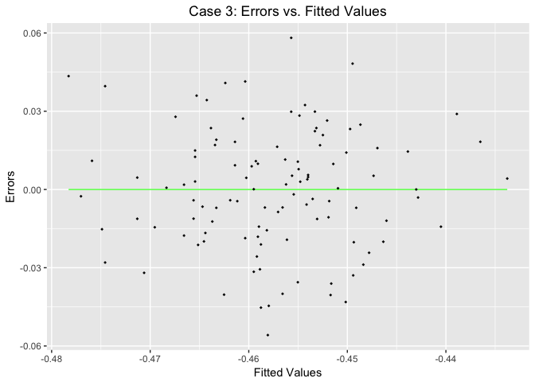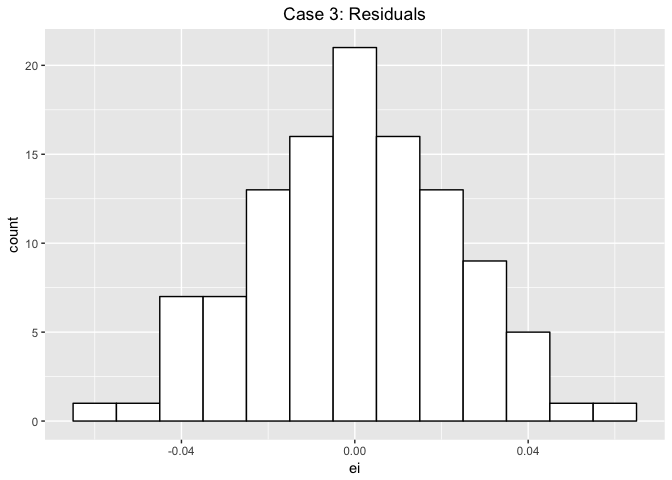

Note that the bin width of the Residuals histogram has been reduced from 0.1 to 0.01.

##### Fligner-Killen (FK) Test

*H*<sub>0</sub> : *σ*<sub>*l**o**w**e**r*</sub><sup>2</sup> = *σ*<sub>*u**p**p**e**r*</sub><sup>2</sup>

*H*<sub>0</sub> : *σ*<sub>*l**o**w**e**r*</sub><sup>2</sup> ≠ *σ*<sub>*u**p**p**e**r*</sub><sup>2</sup>

Since our data or more extreme has the probability of 0.8716303 or more extreme, our data for the Fligner-Killen Test has **failed to reject** the null hypothesis for *α* = 0.05, and so we accept the null hypothesis that our data maintains constant variance.

### Summary: Outliers Removed and Tukey Transformation

##### Assessing Normality

I. QQPlot - PASS

1.  SW - PASS

##### Assessing Constant Variance

1.  Scatterplot: ei vs Fitted Values - PASS

2.  Histogram of ei - PASS

3.  FK - PASS

III. Discussion
===============

We see clearly that removing outliers significantly helped since all estimated errors are unweighted and severely affect the estimated regression line. Furthermore, we see that transformation of data greatly improves violations of underly assumptions, i.e., normality and constant variance. Box-Cox transformation improved the most of the diagnostic tests, and the Tukey transformation rectified all diagnostic tests.

The transformed data definitely fits better relative to the Simple Linear Regression (SLR) model. However, this does come at a cost as transformation obfuscates and makes interpretation of the data becomes difficult, as demonstrated in the evolving histograms of Y.

Case by Case
------------

For Case 1: Remove Outliers only, we see that the linear relationship between and X and Y is still significant (CI and hypothesis testing). Normality is greatly improved as we can see from the histogram of Y, the qqplot, and the failure to reject the null in the Shapiro-Wilks Test. Constant Variance is improved but only slightly. The scatterplot of Errors vs. Fitted Values slightly suggest a cone shape, the histogram of residuals is slightly right skewed, and the Filgner-Killen Test *barely* rejects the null.

For Case 2: Remove outliers and apply the Box-Cox transoformation, we see that the linear relationship of X and Y is still significant (CI and hypothesis testing). We see from the boxplot of Y that the data no longer displays any outliers (red dots), but the histogram of Y clearly shows that interpreting the data is now slightly more difficult. Normality is greatly improved as seen in the qqplot and the high p-value of the Shapiro-Wilks test (failure to reject the null). Constant Variance is improved as demonstrated by the histogram of residuals and the increased p-value in the Fligner-Killen test. The scatterplot of ei vs. Fitted Values displays a slight cone shape, but this may be acceptable as all other assumptions are satisfied.

For Case 3: Remove ouliers and apply the Tukey transformation, we see that the linear relationship of X and Y is still significant (CI and hypothesis testing). We again see from the boxplot of Y that the data no longer displays any outliers, as noted, bin values for the histogram of X and Y needed to be changed, which further emphasizes that transformation of data makes interpretation difficult. Normality is improved as demostrated by an incredibly beautiful qqplot and high p-value for the Shapiro-Wilks test. Constant Variance is also demonstrated by a gorgeous Errors vs. Fitted Values scatterplot, histogram of residuals, and high p-value for the Fligner-Killen test.

Conclusion
----------

Based on our examinations and diagnostic testing, we conclude that if the client is pursing an academic analysis or if time allows for careful interpretation of data, transformation significantly addresses violations of the underly assuptions, i.e., normality and constant variance.

For most cases, when time is limited and practicality is required, removal of outliers is sufficient for rectifying violations of the underlying assumptions of SLR. If some effort is available, Box-Cox transformation is preferred over Tukey's transformation.

### R Appendix Of Code

``` r
# Initialize - Read, Library
#t1 <- read.csv("C:/Users/dletran/Dropbox/Documents/108 - STA, linear regression/Homework/project2/Transform1.csv")
t1 <- read.csv("/Users/dukeletran/Documents/Projects/linear-regression/R/project2/Transform1.csv") 
library(ggplot2)     # for plot
library(gridExtra)   # for mutigrid plot
library(rcompanion)  # for Tukey
library(MASS)        # for Box-Cox

##### I. Original Data
##SUMMARY
#Scatterplot
s <- ggplot(t1, aes(x = X, y = Y)) +
  geom_smooth(method='lm', se = FALSE, color = "purple", size = 0.4) +
  geom_point(size=1, shape=18) +
  ggtitle("Transform1") +
  theme(plot.title = element_text(hjust = 0.5)) +
  ylab("Y") +
  xlab("X")
##Boxplots - Y
b_y <- ggplot(t1,
       aes(y = Y, x = factor(""))) +
  geom_boxplot(fill = "white", colour = "#3366FF", outlier.color = "red", outlier.shape = 1) +
  ylab("Y") +
  xlab(" ") +
  coord_flip() + #flips it from vertical to sideways plots
  ggtitle("Transform1") +
  theme(plot.title = element_text(hjust = 0.5)) +#centers the title
  stat_boxplot(geom ='errorbar')
##Boxplots - X
b_x <- ggplot(t1,
       aes(y = X, x = factor(""))) +
  geom_boxplot(fill = "white", colour = "#3366FF", outlier.color = "red", outlier.shape = 1) +
  ylab("X") +
  xlab(" ") +
  coord_flip() + #flips it from vertical to sideways plots
  ggtitle("Transform1") +
  theme(plot.title = element_text(hjust = 0.5)) +#centers the title
  stat_boxplot(geom ='errorbar')
##Histograms
h_x <- ggplot(t1,
       aes(x = X)) + 
  geom_histogram(binwidth = 3, color = "black",fill = "white") + 
  xlab("X") + 
  ggtitle("Transform1") +
  theme(plot.title = element_text(hjust = 0.5))
h_y <- ggplot(t1,
       aes(x = Y)) + 
  geom_histogram(binwidth = 1, color = "black",fill = "white") + 
  xlab("Y") + 
  ggtitle("Transform1") +
  theme(plot.title = element_text(hjust = 0.5))
#plot
s
grid.arrange(b_x, b_y, h_x, h_y, ncol=2)
##B.DIAGNOSTICS
####ASSESSING LINEARITY
#simple linear model
t1_model = lm(Y ~ X, data=t1)
t1$ei = t1_model$residuals
t1$yhat = t1_model$fitted.values
#confidence interval
t1.CI = confint(t1_model, level=0.99)
t1.CI.b1 = t1.CI[2,]
#summary/hypothesis testing
t1.sum = summary(t1_model)
t1.HT = t1.sum$coefficients
#divide by 2 for one-tailed test
t1.HT.b1.t = t1.HT[2,3]/2 #t-statistic of b1
t1.HT.b1.p = t1.HT[2,4]/2 #p-value of b1
##ASSESSING NORMALITY
# I. QQ Plot
x <- qqnorm(t1_model$residuals)
x <- qqline(t1_model$residuals)
# II. Shapiro-Wilks
#H0: The errors are normally distributed
#HA: The errors are NOT normally distributed
t1.ei = t1_model$residuals
t1.SWtest = shapiro.test(t1.ei)
sw_p = t1.SWtest[2]
##ASSESSING CONSTANT VARIANCE (homoscedasticity)
#III. Scatterplot, ei vs Fitted Values
ggplot(t1, 
       aes(x = yhat, y = ei)) +
  geom_smooth(method='lm', se = FALSE, color = "green", size = 0.4) +
  geom_point(size=1, shape=18) +
  ggtitle("Errors vs. Fitted Values") +
  theme(plot.title = element_text(hjust = 0.5)) +
  ylab("Errors") +
  xlab("Fitted Values")
#IV. Histogram, ei
ggplot(t1,
       aes(x = ei)) + 
  geom_histogram(binwidth = 1, color = "black",fill = "white") + 
  xlab("ei") + 
  ggtitle("Residuals") +
  theme(plot.title = element_text(hjust = 0.5))
#V. Fligner Killeen (FK) test
#H0 \sigma_lower^2 == \sigma_upper^2
#H0 \sigma_lower^2 != \sigma_upper^2
Group = rep("Lower",nrow(t1))
Group[t1$Y > median(t1$Y)] = "Upper"
Group = as.factor(Group)
t1$Group = Group
t1.FKtest = fligner.test(t1$ei, t1$Group)
fk_p = t1.FKtest[3]
#SUMMARY: Original Data
##### Assessing Normality
#I. QQPlot - FAIL (outliers present)
#II. SW - FAIL (rejected H0)
##### Assessing Constant Variance
#III. Scatterplot: ei vs Fitted Values - FAIL (outliers present)
#IV. Histogram of ei - FAIL (outliers present)
#V. FK - FAIL (rejected H0)


##### II. Removing Outliers and Transformation
#You should consider removing outliers, and transforming X, Y or both. You should report back appropriate values (or plots) for every combination of transformations and removing outliers you considered. You should pick your best combination of transformed variables.
##### Case 1: Removing Outliers
cutoff = 5.0
outliers1 = which(t1$ei > cutoff | t1$ei < -cutoff)
t1.2 = t1[-outliers1,]
#CASE 1: SUMMARY OF DATA
#Scatterplot
s <- ggplot(t1.2, aes(x = X, y = Y)) +
  geom_smooth(method='lm', se = FALSE, color = "purple", size = 0.4) +
  geom_point(size=1, shape=18) +
  ggtitle("Case1: Transform1") +
  theme(plot.title = element_text(hjust = 0.5)) +
  ylab("Y") +
  xlab("X")
##Boxplots - Y
b_y <- ggplot(t1.2,
       aes(y = Y, x = factor(""))) +
  geom_boxplot(fill = "white", colour = "#3366FF", outlier.color = "red", outlier.shape = 1) +
  ylab("Y") +
  xlab(" ") +
  coord_flip() + #flips it from vertical to sideways plots
  ggtitle("Case1: Transform1") +
  theme(plot.title = element_text(hjust = 0.5)) +#centers the title
  stat_boxplot(geom ='errorbar')
##Boxplots - X
b_x <- ggplot(t1.2,
       aes(y = X, x = factor(""))) +
  geom_boxplot(fill = "white", colour = "#3366FF", outlier.color = "red", outlier.shape = 1) +
  ylab("X") +
  xlab(" ") +
  coord_flip() + #flips it from vertical to sideways plots
  ggtitle("Case1: Transform1") +
  theme(plot.title = element_text(hjust = 0.5)) +#centers the title
  stat_boxplot(geom ='errorbar')
##Histograms
h_x <- ggplot(t1.2,
       aes(x = X)) + 
  geom_histogram(binwidth = 3, color = "black",fill = "white") + 
  xlab("X") + 
  ggtitle("Case1: Transform1") +
  theme(plot.title = element_text(hjust = 0.5))
h_y <- ggplot(t1.2,
       aes(x = Y)) + 
  geom_histogram(binwidth = 1, color = "black",fill = "white") + 
  xlab("Y") + 
  ggtitle("Case1: Transform1") +
  theme(plot.title = element_text(hjust = 0.5))
#plot
s
grid.arrange(b_x, b_y, h_x, h_y)
#CASE1: DIAGNOSTICS
#simple linear model
t1.2_model = lm(Y ~ X, data=t1.2)
t1.2$ei = t1.2_model$residuals
t1.2$yhat = t1.2_model$fitted.values
#confidence interval
t1.2.CI = confint(t1.2_model, level=0.99)
t1.2.CI.b1 = t1.2.CI[2,]
#summary/hypothesis testing
t1.2.sum = summary(t1.2_model)
t1.2.HT = t1.2.sum$coefficients
#estimated regression line
t1.2.b0 = t1.2.HT[1]
t1.2.b1 = t1.2.HT[2]
#divide by 2 for one-tailed test
t1.2.HT.b1.t = t1.2.HT[2,3]/2 #t-statistic of b1
t1.2.HT.b1.p = t1.2.HT[2,4]/2 #p-value of b1
#simple linear model
t1.2$ei = t1.2_model$residuals
t1.2$yhat = t1.2_model$fitted.values
##ASSESSING NORMALITY
# I. QQ Plot
x <- qqnorm(t1.2_model$residuals)
x <- qqline(t1.2_model$residuals)
# II. Shapiro-Wilks
#H0: The errors are normally distributed
#HA: The errors are NOT normally distributed
t1.2.ei = t1.2_model$residuals
t1.2.SWtest = shapiro.test(t1.2.ei)
sw_p = t1.2.SWtest[2]
##ASSESSING CONSTANT VARIANCE (homoscedasticity)
#III. Scatterplot, ei vs Fitted Values
ggplot(t1.2, 
       aes(x = yhat, y = ei)) +
  geom_smooth(method='lm', se = FALSE, color = "green", size = 0.4) +
  geom_point(size=1, shape=18) +
  ggtitle("Case 1: Errors vs. Fitted Values") +
  theme(plot.title = element_text(hjust = 0.5)) +
  ylab("Errors") +
  xlab("Fitted Values")
#IV. Histogram, ei
ggplot(t1.2,
       aes(x = ei)) + 
  geom_histogram(binwidth = 1, color = "black",fill = "white") + 
  xlab("ei") + 
  ggtitle("Case 1: Residuals") +
  theme(plot.title = element_text(hjust = 0.5))
#V. Fligner Killeen (FK) test
#H0 \sigma_lower^2 == \sigma_upper^2
#H0 \sigma_lower^2 != \sigma_upper^2
Group = rep("Lower",nrow(t1.2))
Group[t1.2$Y > median(t1.2$Y)] = "Upper"
Group = as.factor(Group)
t1.2$Group = Group
t1.2.FKtest = fligner.test(t1.2$ei, t1.2$Group)
fk_p = t1.2.FKtest[3]
#### Summary, Case 1: Outliers Removed
##### Assessing Normality
#I. QQPlot - PASS (improved)
#II. SW - PASS (improved)
##### Assessing Constant Variance
#III. Scatterplot: ei vs Fitted Values - FAILED (cone shaped)
#IV. Histogram of ei - PASS
#V. FK - PASS, barely (improved H0)
##### Case2: Box-Cox Transformation
#Box Cox Transformation
t1.2.BC = boxcox(t1.2_model,lambda = seq(-6,6,0.01), plotit = TRUE) #set ranges of -6 to 6, step by 0.1
t1.2.BC.lambda = t1.2.BC$x[which.max(t1.2.BC$y)] #note, lambda = 0. use ln
# new data frame and model
t1.2.BC.Y = log(t1.2$Y)
t1.2_box = data.frame(X = t1.2$X, Y = t1.2.BC.Y)
t1.2_box_model = lm(Y ~ X, data = t1.2_box)
t1.2_Box.sw_pval = shapiro.test(t1.2_box_model$residuals)$p.val
##### I. Introduction
#Scatterplot
s <- ggplot(t1.2_box, aes(x = X, y = Y)) +
  geom_smooth(method='lm', se = FALSE, color = "purple", size = 0.4) +
  geom_point(size=1, shape=18) +
  ggtitle("Case 2: Box-Cox Tranformation") +
  theme(plot.title = element_text(hjust = 0.5)) +
  ylab("Box-Cox transformed Y") +
  xlab("Box-Cox transformed X")
##Boxplots - Y
b_y <- ggplot(t1.2_box,
       aes(y = Y, x = factor(""))) +
  geom_boxplot(fill = "white", colour = "#3366FF", outlier.color = "red", outlier.shape = 1) +
  ylab("Y") +
  xlab(" ") +
  coord_flip() + #flips it from vertical to sideways plots
  ggtitle("Case 2: Transform1 (Box-Cox)") +
  theme(plot.title = element_text(hjust = 0.5)) +#centers the title
  stat_boxplot(geom ='errorbar')
##Boxplots - X
b_x <- ggplot(t1.2_box,
       aes(y = X, x = factor(""))) +
  geom_boxplot(fill = "white", colour = "#3366FF", outlier.color = "red", outlier.shape = 1) +
  ylab("X") +
  xlab(" ") +
  coord_flip() + #flips it from vertical to sideways plots
  ggtitle("Case 2: Transform1 (Box-Cox)") +
  theme(plot.title = element_text(hjust = 0.5)) +#centers the title
  stat_boxplot(geom ='errorbar')
##Histograms
h_x <- ggplot(t1.2_box,
       aes(x = X)) + 
  geom_histogram(binwidth = 3, color = "black",fill = "white") + 
  xlab("X") + 
  ggtitle("Case 2: Transform1 (Box-Cox)") +
  theme(plot.title = element_text(hjust = 0.1))
h_y <- ggplot(t1.2_box,
       aes(x = Y)) + 
  geom_histogram(binwidth = 1, color = "black",fill = "white") + 
  xlab("Y") + 
  ggtitle("Case 2: Transform1 (Box-Cox)") +
  theme(plot.title = element_text(hjust = 0.2))
#plot
s
grid.arrange(b_x, b_y, h_x, h_y)
####ASSESSING LINEARITY
#simple linear model
t1.2_box_model = lm(Y ~ X, data=t1.2_box)
t1.2_box$ei = t1.2_box_model$residuals
t1.2_box$yhat = t1.2_box_model$fitted.values
#confidence interval
t1.2_box.CI = confint(t1.2_box_model, level=0.99)
t1.2_box.CI.b1 = t1.2_box.CI[2,]
#summary/hypothesis testing
t1.2_box.sum = summary(t1.2_box_model)
t1.2_box.HT = t1.2_box.sum$coefficients
#estimated regression line
t1.2_box.b0 = t1.2_box.HT[1]
t1.2_box.b1 = t1.2_box.HT[2]
#divide by 2 for one-tailed test
t1.2_box.HT.b1.t = t1.2_box.HT[2,3]/2 #t-statistic of b1
t1.2_box.HT.b1.p = t1.2_box.HT[2,4]/2 #p-value of b1
##ASSESSING NORMALITY
# I. QQ Plot
x <- qqnorm(t1.2_box_model$residuals)
x <- qqline(t1.2_box_model$residuals)
# II. Shapiro-Wilks
#H0: The errors are normally distributed
#HA: The errors are NOT normally distributed
t1.2_box.ei = t1.2_box_model$residuals
t1.2_box.SWtest = shapiro.test(t1.2_box.ei)
sw_p = t1.2_box.SWtest[2]
##ASSESSING CONSTANT VARIANCE (homoscedasticity)
#III. Scatterplot, ei vs Fitted Values
ggplot(t1.2_box, 
       aes(x = yhat, y = ei)) +
  geom_smooth(method='lm', se = FALSE, color = "green", size = 0.4) +
  geom_point(size=1, shape=18) +
  ggtitle("Case 2: Errors vs. Fitted Values") +
  theme(plot.title = element_text(hjust = 0.5)) +
  ylab("Errors") +
  xlab("Fitted Values")
#IV. Histogram, ei
ggplot(t1.2_box,
       aes(x = ei)) + 
  geom_histogram(binwidth = 0.1, color = "black",fill = "white") + 
  xlab("ei") + 
  ggtitle("Case 2: Residuals") +
  theme(plot.title = element_text(hjust = 0.5))
#V. Fligner Killeen (FK) test
#H0 \sigma_lower^2 == \sigma_upper^2
#H0 \sigma_lower^2 != \sigma_upper^2
Group = rep("Lower",nrow(t1.2_box))
Group[t1.2_box$Y > median(t1.2_box$Y)] = "Upper"
Group = as.factor(Group)
t1.2_box$Group = Group
t1.2_box.FKtest = fligner.test(t1.2_box$ei, t1.2_box$Group)
fk_p = t1.2_box.FKtest[3]
#SUMMARY: CASE 2
##### Assessing Normality
#I. QQPlot - PASS 
#II. SW - PASS
##### Assessing Constant Variance
#III. Scatterplot: ei vs Fitted Values - FAIL (reverse cone)
#IV. Histogram of ei - PASS
#V. FK - FAIL (rejected H0)
##### Case 3: Tukey Transformation
t1.2.tukeyY = transformTukey(t1.2$Y, plotit=FALSE)
t1.2.tukeyX = transformTukey(t1.2$X, plotit=FALSE)
t1.2_tukey = data.frame(Y=t1.2.tukeyY, X=t1.2.tukeyX)
t1.2_tukey_model = lm(Y ~ X, data=t1.2_tukey)
#CASE3: SUMMARY OF DATA
#Scatterplot
s <- ggplot(t1.2_tukey, aes(x = X, y = Y)) +
  geom_smooth(method='lm', se = FALSE, color = "purple", size = 0.4) +
  geom_point(size=1, shape=18) +
  ggtitle("Case 3: Tukey Transformation") +
  theme(plot.title = element_text(hjust = 0.5)) +
  ylab("Y Tukey transformed") +
  xlab("X Tukey transformed")
##Boxplots - Y
b_y <- ggplot(t1.2_tukey,
       aes(y = Y, x = factor(""))) +
  geom_boxplot(fill = "white", colour = "#3366FF", outlier.color = "red", outlier.shape = 1) +
  ylab("Y") +
  xlab(" ") +
  coord_flip() + #flips it from vertical to sideways plots
  ggtitle("Case 3: Transform1") +
  theme(plot.title = element_text(hjust = 0.5)) +#centers the title
  stat_boxplot(geom ='errorbar')
##Boxplots - X
b_x <- ggplot(t1.2_tukey,
       aes(y = X, x = factor(""))) +
  geom_boxplot(fill = "white", colour = "#3366FF", outlier.color = "red", outlier.shape = 1) +
  ylab("X") +
  xlab(" ") +
  coord_flip() + #flips it from vertical to sideways plots
  ggtitle("Case 3: Transform1") +
  theme(plot.title = element_text(hjust = 0.5)) +#centers the title
  stat_boxplot(geom ='errorbar')
##Histograms
h_x <- ggplot(t1.2_tukey,
       aes(x = X)) + 
  geom_histogram(binwidth = 0.3, color = "black",fill = "white") + 
  xlab("X") + 
  ggtitle("Case 3: Transform1") +
  theme(plot.title = element_text(hjust = 0.1))
h_y <- ggplot(t1.2_tukey,
       aes(x = Y)) + 
  geom_histogram(binwidth = 0.1, color = "black",fill = "white") + 
  xlab("Y") + 
  ggtitle("Case 3: Transform1") +
  theme(plot.title = element_text(hjust = 0.5))
#plot
s
grid.arrange(b_x, b_y, h_x, h_y)
#CASE 3: DIAGNOSTICS
#simple linear model
t1.2_box_tukey = lm(Y ~ X, data=t1.2_tukey)
t1.2_tukey$ei = t1.2_box_tukey$residuals
t1.2_tukey$yhat = t1.2_box_tukey$fitted.values
#confidence interval
t1.2_tukey.CI = confint(t1.2_box_tukey, level=0.99)
t1.2_tukey.CI.b1 = t1.2_tukey.CI[2,]
#summary/hypothesis testing
t1.2_tukey.sum = summary(t1.2_box_tukey)
t1.2_tukey.HT = t1.2_tukey.sum$coefficients
#estimated regression line
t1.2_tukey.b0 = t1.2_tukey.HT[1]
t1.2_tukey.b1 = t1.2_tukey.HT[2]
#divide by 2 for one-tailed test
t1.2_tukey.HT.b1.t = t1.2_tukey.HT[2,3]/2 #t-statistic of b1
t1.2_tukey.HT.b1.p = t1.2_tukey.HT[2,4]/2 #p-value of b1
##ASSESSING NORMALITY
# I. QQ Plot
x <- qqnorm(t1.2_tukey_model$residuals)
x <- qqline(t1.2_tukey_model$residuals)
# II. Shapiro-Wilks
#H0: The errors are normally distributed
#HA: The errors are NOT normally distributed
t1.2_tukey.ei = t1.2_tukey_model$residuals
t1.2_tukey.SWtest = shapiro.test(t1.2_tukey.ei)
sw_p = t1.2_tukey.SWtest[2]
##ASSESSING CONSTANT VARIANCE (homoscedasticity)
#III. Scatterplot, ei vs Fitted Values
ggplot(t1.2_tukey, 
       aes(x = yhat, y = ei)) +
  geom_smooth(method='lm', se = FALSE, color = "green", size = 0.4) +
  geom_point(size=1, shape=18) +
  ggtitle("Case 3: Errors vs. Fitted Values") +
  theme(plot.title = element_text(hjust = 0.5)) +
  ylab("Errors") +
  xlab("Fitted Values")
#IV. Histogram, ei
ggplot(t1.2_tukey,
       aes(x = ei)) + 
  geom_histogram(binwidth = 0.01, color = "black",fill = "white") + 
  xlab("ei") + 
  ggtitle("Case 3: Residuals") +
  theme(plot.title = element_text(hjust = 0.5))
#V. Fligner Killeen (FK) test
#H0 \sigma_lower^2 == \sigma_upper^2
#H0 \sigma_lower^2 != \sigma_upper^2
Group = rep("Lower",nrow(t1.2_tukey))
Group[t1.2_tukey$Y > median(t1.2_tukey$Y)] = "Upper"
Group = as.factor(Group)
t1.2_tukey$Group = Group
t1.2_tukey.FKtest = fligner.test(t1.2_tukey$ei, t1.2_tukey$Group)
fk_p = t1.2_tukey.FKtest[3]
#SUMMARY: Tukey Transformation
##### Assessing Normality
#I. QQPlot - FAIL (outliers present)
#II. SW - FAIL (rejected H0)
##### Assessing Constant Variance
#III. Scatterplot: ei vs Fitted Values - FAIL (outliers present)
#IV. Histogram of ei - FAIL (outliers present)
#V. FK - FAIL (rejected H0)


##### III. Discussion
#Discuss your results. Did transforming the data help? What are the downsides? Do you believe the transformed data is a better fit? What would you suggest for a client who wants to use this data set for simple linear regression (which transformations would you use, if any)?
```
