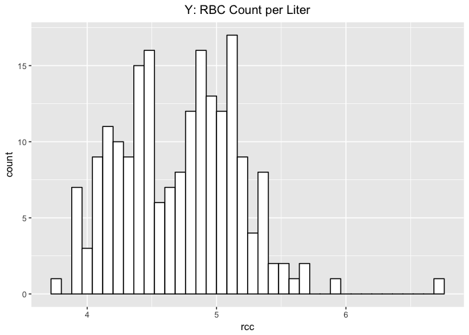
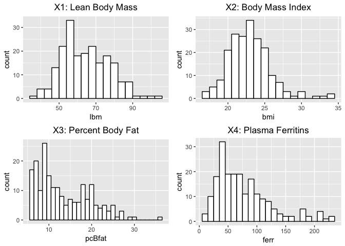
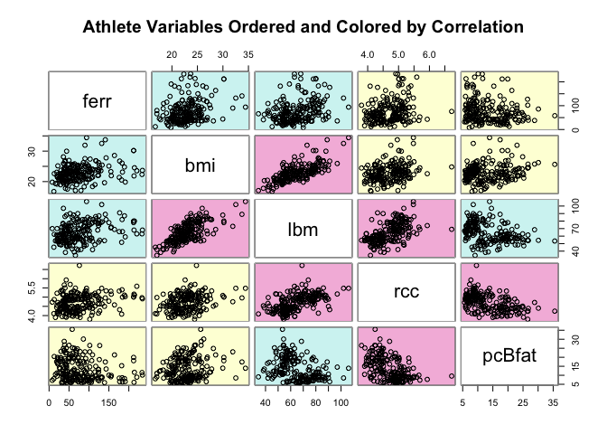
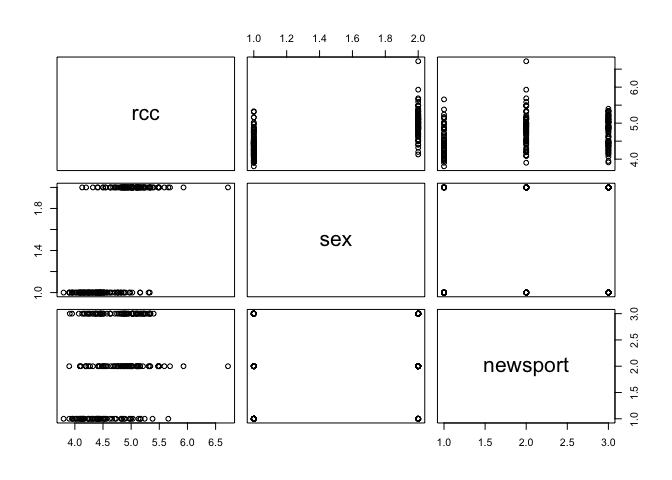
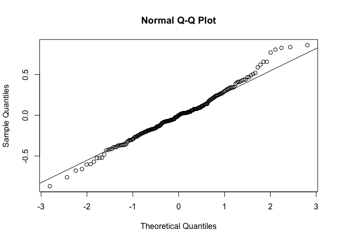

TOPIC 2: Multivarate Regression Analysis for Athlete's Red Blood Cell count per liter
================
Duke LeTran
November 28th, 2017

I. Introduction
===============

This report aims to analyze the dataset "athlete.csv" to provide some meaningful interpretations. The dataset consists of one response random variable (Y) -- Red Blood Cell Count per liter -- and six columns of explanatory random variables, of which four are numerical and two are categorical. In summary:

-   Y, rcc, numerical, Red Blood Cell (RBC) count (per liter)

-   X1, lbm, numerical, lean body mass (mass that is lean muscle) in kg

-   X2, bmi, numerical, Body mass index (kg)

-   X3, pcBfat, numerical, Percent body fat

-   X4, ferr, numerical, Plasma ferritins, ng (a measure of iron in the blood)

-   X5, sex, categorical, \['m', 'f'\]

-   X6, newsport, categorical, \['Net', 'Swim', 'Run'\]

The question we are trying to answer:

    Which combination of explantory variables provides us with the "correct" model in regards to determining an athlete's Red Blood Cell Count per Liter?

Perhaps the client, such as a professional sports team, found a popular science article that insisted on a correlation between RBC count per liter and athletic performance. However, the league has banned all measurement of RBC counts especially if that info is utilized to discriminate against potential athletes. Since the client, as a major sports team, may have sufficient or perhaps even excess resources, the client is looking for a proxy by gathering all the data that may correlate with RBC counts through an no-expense-spared project.

As a statistician and scientist, we refuse to provide a purely predictive model and argue that this must be purely an academic study. The team compromises and agree since a "purely academic " study also may be more likely accepted by the league. Despite moral concerns raised from fair-play non-profit groups, we oblige to help the team in pursuit of determining the "correct" model that is describes the relationship with Y.

The approach we intend to take is attempt to fit our data to the model:

    Multivariate Regression Analysis, with Forward-Backward Step-Wise Model Selection

Let's first begin with some exploratory data analysis.

II. Summary of Data
===================

Let's begin by conducting some exploratory analysis of our dataset which consists of n = 202 randomly sampled athletes. Below is a histogram of our random variable Y, RBC Count per Liter:

Response Variable (*Y*)
-----------------------



Immediately, we see from our histogram of RBC Count per Liter(Y) is non-ideal, but we will try to work with what we have. There is clearly some bimodal rather than normal distribution, and from the summary of data, we see the mean is 4.719, which is exactly where the split occurs. Futhermore, a clear outlier is seen in the range of Y &gt; 6.5, and from the summary of data, our max value of 6.72 is likely the outlier.

Explanatory Variables (*X*<sub>*i*</sub>)
-----------------------------------------

### Numerical



For our numerical data, we see the distributions are also not ideal but moderately okay. **X1: Lean Body Mass** and **X2: Body Mass Index** are relatively distributed normal, perhaps with a slight right skew. **X3: Percent Body Fat** and **X4: Plasma Ferritins** are very obviously right skewed, so caution must be exercised.

#### Scatterplot Matrix: Numerical

Let us also briefly examine the scatterplot matrix of the numerical data to see if we can immediately visualize any trends.



Since our response variable is RBC Count per Liter (rcc), let us focus on any possible correlations by moving along the rcc row (this places rcc on the Y axis). We see that **X1: Lean Body Mass (lbm)** shows positive correlation and **X3: Percent Body Fat (pcBfat)** shows negative correlation, which makes sense intuitively. If RBC Count is associated with being healthier, then lbm should have a positive correlation and pcBfat should have a negative correlation. **X2: BMI** and **X4: Plasma Ferritins** seem to also display some weaker positive correlation to rcc, but we will need confirm in our model selection process.

### Categorical

**X5: Sex** We see a relatively equal distribution between male (m = 102) and female (f = 100).

\begin{equation} 
  X_{5, sex} = 
    \begin{cases} 
      1, & \text{if}\ male \\ 
      0, & \text{otherwise} 
    \end{cases} \
\end{equation}
**X6: newsport** For the three categories of Net, Run, or Swim, we see a slightly unequal distribution of 29%, 33%, and 38%, respectively.

\begin{equation} 
  X_{6, Run} = 
    \begin{cases} 
      1, & \text{if}\ Run \\ 
      0, & \text{otherwise} 
    \end{cases} \
\end{equation}
\begin{equation} 
  X_{6, Swim} = 
    \begin{cases} 
      1, & \text{if}\ Swim \\ 
      0, & \text{otherwise} 
    \end{cases} \
\end{equation}
#### Scatterplot Matrix: Categorical



Again, since rcc is our response variable, we more across the first row to place rcc on the Y axis. For X5: Sex, there seems to be some differences between male and female with at least one outlier. For X6: newsport, the categories may display slight differences that are more subtle, but there is definitely one distinct outlier in the middle group.

III. Model Selection
====================

Based on our exploratory analysis, we have four potential *X*<sub>*i*</sub>, of which four are numerical and two are categorical. In total, we have seven potential *b*<sub>*i*</sub> for our model. Let's proceed to perform model selection.

For our methodology, we decide on the method **Forward-Backward (FB) Step-Wise Selection** because it tends to inherently select the "correct model."

Forward Selection (FS) alone may end the selection process too early and underfit the model -- a detrimental effect if we are looking for the correct model. We absolutely do not want to drop an important X if it highly correlates with Y. Comparatively, Backwards Selection (BS) tends to overfit a model since it starts with the full model and may end the selection too early; a predictive model is not our intended goal. Backward Forward (BF) Step-Wise Selection can reduce this overfitting, but since FB will likely choose a smaller model, FB selection is our justified choice.

For our selection criteria, we will use Baysian Information Criteria (BIC) as this tends to select for the "correct" model.

Our estimated regression line is:

*Y* = 4.3203209 + 0.5800667*X*<sub>5, *m**a**l**e*</sub> + 0.1997876*X*<sub>6, *R**u**n*</sub> + 0.1039817*X*<sub>6, *S**w**i**m*</sub>

IV. Diagnostics
===============

### Introduction

In this section, we check for outliers, perform diagnostic tests on underlying assumptions, i.e., normality and constant variance, and also conduct new iterations of model selection if outliers are removed.

### A. Diagnostics: Outliers, Leverage Points, and further iterations of model selection

#### Outliers

Let us check for outliers firstly, as we could see a few in the original scatterplot matricies.

We determine our studentized semi-studentized residuals (*e*<sub>*i*</sub><sup>\*</sup>), studentized residuals (*r*<sub>*i*</sub>), and deleted residuals (*t*<sub>*i*</sub>). Based on the t distribution, we use the *α* = 0.10 and our three residuals, our cutoff is 3.5420622.

Based on our dataset, our determined outlier of row 166 has the values:

-   $\\hat{Y\_{166}}$ = 6.72

-   *X*<sub>1</sub> = 69

-   *X*<sub>2</sub> = 24.81

-   *X*<sub>3</sub> = 9.56

-   *X*<sub>4</sub> = 76

-   *X*<sub>5</sub> = Male

-   *X*<sub>6</sub> = Run

Note that this confirms our potential outlier in our histogram of Y during our exploratory analysis.

#### Leverage Values

Leverage values are points that strongly influence the regression fit, and outliers are often leverage points (hence the need remove outliers). Let us assess if our outlier appears to be a leverage point, and if so, this will confirm our decision to complete excise the tumorous data point from our dataset.

*1. Hat Matrix*

If any element (*h*<sub>*i**i*</sub>) in this matrix is greater than 2*p*/*n*, where *p* is the number of *b*<sub>*i*</sub>, they this data point may likely be considered a leverage point.

*2. Difference in Fitted Values*

The Difference in Fitted Values (*D**F*<sub>*i*</sub>) measures the number of estimated standard deviations of $\\hat{Y\_i}$ that the fitted value changes when we exclude that specific *i*<sub>*t**h*</sub> row. If the *D**F*<sub>*i*</sub> is greater than 1, we consider this to be a high leverage point.

*3. Cook's Distance*

In contrast to *D**F*<sub>*i*</sub>, Cook's Distance calculates the difference between all $\\hat{Y\_i}$ to all the new fitted values.

*4. DF *β*s*

This is a measure of how much our estimated *β*<sub>*i*</sub> (*b*<sub>*i*</sub>) change when we remove a row, and if this removal affects the slope, the row may be a leverage point.

*Results: Leverage Points Tests*

Based on the four categories of leverage points tests, no datapoints were considered leverage points. See R Appendix Of Code for further detail.

### Removal of Outlier and Model Testing

We did discover an outlier at $\\hat{Y\_{166}}$, but based on our tests, the outlier did not appear to be a leverage point. However, since outliers severely affect the estimated regression line, we decide to remove this data point anyways, and in order to exercise caution, we re-run model selection via the FB selection method with the BIC criterion.

The results suggest our new estimated regression line is:

*Y* = 4.404500 + 0.605302*X*<sub>5, *m**a**l**e*</sub>

Since the public generally is generally prone to misinformation and misinterpretation of statistics, i.e., Case Study: Red Wine is correlated with the reduction of heart disease, we become hesitant to to drop both *X*<sub>6, *R**u**n*</sub> and *X*<sub>6, *S**w**i**m*</sub> since this new model appears to denote a slightly sexist perspective. Let us conduct two more tests, the *F*<sub>*s*</sub> and a partial *R*<sup>2</sup>. to determine which model to keep.

The following tests utilize the new dataset without the outlier.

#### F statistics Hypothesis Testing

-   *H*<sub>0</sub>: *β*<sub>6, *R**u**n*</sub> = *β*<sub>6, *S**w**i**m*</sub> = 0, in which case, at least one *β* can be dropped from the larger model but not necessarily both.

-   *H*<sub>*A*</sub>: At least one *β*<sub>6, *R**u**n*</sub> or *β*<sub>6, *S**w**i**m*</sub> does not equal zero and cannot be dropped. The reduced model does **NOT** fit better.

The value of *F*<sub>*s*</sub> is 4.9286 and the corresponding p-value is: 0.0081541. Since our p-value is less than our *α* = 0.10, we reject the null hypothesis and accept the alternative that the at least one *β*<sub>6</sub> is **not** zero and **cannot** be dropped.

#### Partial *R*<sup>2</sup> tests

For thoroughness and to remove any qualms about keeping *X*<sub>6</sub>, let us also conduct a Partial *R*<sup>2</sup> test to see if adding *X*<sub>6</sub> with be worth the error reduction.

*R*<sup>2</sup>{*X*<sub>6, *R**u**n*</sub>, *X*<sub>6, *S**w**i**m*</sub>|*X*<sub>5</sub>} = 4.77%

When we add information on which sport the athlete plays to a model with information on gender, we reduce our overall error by 4.77%. Since we are looking for the "correct" model to describe RBC count, this reduction in error more than sufficient as we would rather not risk underfitting the model.

#### Conclusion: Outlier and Model Selection

Based on our outlier diagnostics, we found that the the outlier identified in the scatterplots of our exploratory analysis was indeed present in our results. Though the outlier does not appear to be a leverage point, we proceed to remove the data point out of caution. Futhermore, we re-iterated the model selection process, and the new dataset (with the outlier removed) suggested dropping *X*<sub>6</sub> though our *F* hypothesis testing and partial *R*<sup>2</sup> suggested otherwise.

*Y* = 4.3241014 + 0.5661261*X*<sub>5, *m**a**l**e*</sub> + 0.1799131*X*<sub>6, *R**u**n*</sub> + 0.1084555*X*<sub>6, *S**w**i**m*</sub>

Above is the model determined based on these conclusions.

### B. Diagnostics: Assessing Normality

#### QQPlot



##### Shaprio-Wilks

*H*<sub>0</sub>: The errors are normally distributed

*H*<sub>*A*</sub>: The errors are NOT normally distributed

Since our data or more extreme has the probability of 0.1483928 or more extreme, we **fail to reject** the null hypothesis for *α* = 0.10, and so we accept the null hypothesis that our data is normally distributed.

### C. Diagnostics: Assessing Constant Variance

##### Fligner-Killen (FK) Test

*H*<sub>0</sub> : *σ*<sub>*l**o**w**e**r*</sub><sup>2</sup> = *σ*<sub>*u**p**p**e**r*</sub><sup>2</sup>

*H*<sub>0</sub> : *σ*<sub>*l**o**w**e**r*</sub><sup>2</sup> ≠ *σ*<sub>*u**p**p**e**r*</sub><sup>2</sup>

Since our data or more extreme has the probability of 0.68182 or more extreme, our data for the Fligner-Killen Test has **failed to reject** the null hypothesis for *α* = 0.10, and so we accept the null hypothesis that our our data does maintain constant variance.

V. Analysis and Interpretations
===============================

### A. Diagnostics: Underlying Assumptions

#### Summary

*Assessing Normality*

-   QQPlot - PASS

-   SW - PASS

*Assessing Constant Variance*

-   FK - PASS

Based on our diagnostic tests, our data passes all underlying assumptions; however, the authors of this paper highly recommends caution as there is evidence in the original histogram of Y to suggest otherwise. There seemed to be a bimodal distribution of the RBC count per liter, which is symetrical in shape and suggests why the FK test passes. We highly suggest either transformation of Y or perhaps reconsideration of this model.

### B. Assessing Linearity

For reference, here again is our estimated regression model:

*Y* = 4.3241014 + 0.5661261*X*<sub>5, *m**a**l**e*</sub> + 0.1799131*X*<sub>6, *R**u**n*</sub> + 0.1084555*X*<sub>6, *S**w**i**m*</sub>

**Confidence Interval**

***β*<sub>5</sub>** We are 90% family-wise confident that that when the athlete is male, the estimated change of RBC increases, on average, between 0.4907026 and 0.6415496, relative to when the athlete is female, holding all other variables constant. Since zero is not included in the confidence interval of *β*, a significant relationship is suggested between RBC Count per liter and and the athlete's sex.

***β*<sub>6, *R**u**n*</sub>** We are 90% family-wise confident that that when the athlete is a runner, the estimated change of Y increases, on average, between 0.0850619 and 0.2747643, relative to otherwise, while holding all other variables constant. Since zero is not included in the confidence interval of *β*, a significant relationship is suggested between RBC Count per liter and an athlete's identity as a runner.

***β*<sub>6, *S**w**i**m*</sub>** We are 90% family-wise confident that that when the athlete is a swimmer, the estimated change of Y increases, on average, between 0.0166646 and 0.2002464, relative to otherwise, holding all other variables constant. Since zero is not included in the confidence interval of *β*, a significant relationship is suggested between RBC count per liter and an athlete's identity as a swimmer.

**Hypothesis Testing**

-   *H*<sub>0</sub>: There is no significant linear relationship between RBC Count per liter and *X*<sub>*i*</sub>

-   *H*<sub>*A*</sub>: There is a significant linear relationshp between RBC Count and *X*<sub>*i*</sub>

***X*<sub>5</sub>** Assuming that the null is true, the test statistic of 6.2022742 shows that our data or more extreme has the probability of 8.650555710^{-27} which is less than our *α* = 0.10. Thus, we reject the null hypothesis and accept the alternative hypothesis that there is a significant linear relationship between RBC count per liter and athlete's sex.

***X*<sub>6, *R**u**n*</sub>** Assuming that the null is true, the test statistic of 1.5673437 shows that our data or more extreme has the probability of 9.916926610^{-4} which is less than our *α* = 0.10. Thus, we reject the null hypothesis and accept the alternative hypothesis that there is a significant linear relationship between RBC count per liter and an athlete's identity as a runner.

***X*<sub>6, *S**w**i**m*</sub>** Assuming that the null is true, the test statistic of 0.9763298 shows that our data or more extreme has the probability of 0.0261383 which is less than our *α* = 0.10. Thus, we reject the null hypothesis and accept the alternative hypothesis that there is a significant linear relationship between RBC count per liter and an athlete's identity as a swimmer.

VI. Conclusions
===============

Based on forward-backward(FB) selection process, we have selected the model with *X*<sub>5</sub> and *X*<sub>6</sub>, which consists of two categorical explanatory variables and three *b*<sub>*i*</sub>. This is contratry to our expectations from the exploratory analysis as we could visualize potentially significant relationships between Y, RBC count per liter, and various numerical variables. This may likely be due to our intent to select the "correct" model, and so perhaps a few of those explanatory variable would be present in a "predictive" model.

Our hypothesis testing and confidence intervals suggest a significant relationship between RBC count per liter (*Y*) and athlete's sex (*X*<sub>5</sub>), athlete's identity as runner (*X*<sub>6, *R**u**n*</sub>), and an athlete's identity as a swimmer(*X*<sub>6, *S**w**i**m*</sub>). However, not yet noted is that the p-value for our hypothesis test of *β*<sub>6, *S**w**i**m*</sub> is relatively high and would not pass for stricter *α* values. This perhaps may suggest that *X*<sub>6</sub> is borderline significant and provide explanation as to contratry interpretation by the second iteration of our FB selection process (to eliminate *X*<sub>6</sub>) and and our F statistics test. The partial *R*<sup>2</sup> value also did not provide us a clear message as to wheter not we should keep *X*<sub>6</sub>. Our decision to keep the variable is based on the reasoning that an underfitted model is worse than a borderline or overfitted model.

The outlier identified in our exploratory analysis was successfully confirmed by our later tests.

All diagnostic tests of normality and constant variance surprisingly passed, bug again, we highly recommend caution as the scatterplots and histograms say otherwise.

### R Appendix Of Code

``` r
# Initialize - Read, PC
#a <- read.csv("C:/Users/dletran/Dropbox/Documents/108 - STA, linear regression/Homework/project2/athlete.csv")
a <- read.csv("/Users/dukeletran/Documents/Projects/linear-regression/R/project2/athlete.csv") 

# Initialize - Read, Library
library(ggplot2) #plot
library(gridExtra) #for multigrid scatterplots
library(gclus) #for colored scatterplots matrices
library(leaps) #for regsubset
library(MASS) #stepwise regression
#Initialize - Functions
Partial.R2 = function(small.model,big.model){ #note, models switched
  SSE1 = sum(small.model$residuals^2)
  SSE2 = sum(big.model$residuals^2)
  PR2 = (SSE1 - SSE2)/SSE1
  return(PR2)
}
##### I. Introduction
##### II. Summary of Data
#rcc
ggplot(a,
       aes(x = rcc)) + 
  geom_histogram(binwidth = 0.08, color = "black",fill = "white") + 
  xlab("rcc") + 
  ggtitle("Y: RBC Count per Liter") +
  theme(plot.title = element_text(hjust = 0.5))
#lbm
h_lbm <- ggplot(a,
       aes(x = lbm)) + 
  geom_histogram(binwidth = 4, color = "black",fill = "white") + 
  xlab("lbm") + 
  ggtitle("X1: Lean Body Mass") +
  theme(plot.title = element_text(hjust = 0.5))

#bmi
h_bmi <- ggplot(a,
       aes(x = bmi)) + 
  geom_histogram(binwidth = 1, color = "black",fill = "white") + 
  xlab("bmi") + 
  ggtitle("X2: Body Mass Index") +
  theme(plot.title = element_text(hjust = 0.5))

#pcBfat
h_pcBfat <- ggplot(a,
       aes(x = pcBfat)) + 
  geom_histogram(binwidth = 1, color = "black",fill = "white") + 
  xlab("pcBfat") + 
  ggtitle("X3: Percent Body Fat") +
  theme(plot.title = element_text(hjust = 0.5))

#ferr
h_ferr <- ggplot(a,
       aes(x = ferr)) + 
  geom_histogram(binwidth = 10, color = "black",fill = "white") + 
  xlab("ferr") + 
  ggtitle("X4: Plasma Ferritins") +
  theme(plot.title = element_text(hjust = 0.5))

grid.arrange(h_lbm, h_bmi, h_pcBfat, h_ferr, ncol=2)
#scatterplot matrix
dta <- a[c(1,2,3,4,5)] #grab only numerical cols
dta.r <- abs(cor(dta)) #get correlations
dta.col <- dmat.color(dta.r) #get colors
dta.o <-  order.single(dta.r) #reorder variables so those with highest corr are closest to diagonal
cpairs(dta, dta.o, panel.colors=dta.col, gap=0.5,
       main="Athlete Variables Ordered and Colored by Correlation")
dta_cat <- a[c(1,6,7)] 
plot(dta_cat)
##### III. Model Selection
a2 <- a #use a2 for non-descriptive X names
names(a2) <- c("Y", "X1", "X2", "X3", "X4", "X5", "X6") 
#Stepwise selection -- General
full.model = lm(Y~ X1 + X2 + X3 + X4 + X5 + X6, data = a2)
empty.model = lm(Y ~ 1,data = a2)

#Forward step-wise selection
n = nrow(a2)
#AIC - note the k=2
#forward.model.AIC = stepAIC(empty.model, scope = list(lower=empty.model, upper=full.model), k=2, direction="forward", trace=FALSE)
#BIC - note the k=log(n)
#forward.model.BIC = stepAIC(empty.model,  scope = list(lower = empty.model, upper = full.model), k=log(n), direction="forward", trace=FALSE)

#Forwards-Backwards selection
#FB.model.AIC = stepAIC(empty.model, scope = list(lower=empty.model, upper= full.model), k=2, direction="both", trace=FALSE)
FB.model.BIC = stepAIC(empty.model, scope = list(lower=empty.model, upper= full.model), k=log(n), direction="both", trace=FALSE)
best_model = FB.model.BIC
#Backwards-Forwards selection
#BF.model.AIC = stepAIC(full.model, scope = list(lower=empty.model, upper= full.model), k=2, direction="both", trace=FALSE)
#BF.model.BIC = stepAIC(full.model, scope = list(lower=empty.model, upper= full.model), k=log(n), direction="both", trace=FALSE)
betas_1 = FB.model.BIC$coefficients
##### IV. Diagnostics
##A. OUTLIERS AND LEVERAGE POINTS
#OUTLIERS
#semi-studentized residuals
ei.s = best_model$residuals/sqrt(sum(best_model$residuals^2)/(nrow(a2) - length(best_model$coefficients)))
#studentized residuals
ri = rstandard(best_model)
#deleted residuals
ti = rstudent(best_model)
##identifying outliers
alpha = 0.10
n = nrow(a2)
p = length(best_model$coefficients)
#calculating cuffoffs using determined alpha
cutoff = qt(1-alpha/(2*n), n -p )
cutoff.deleted = qt(1-alpha/(2*n), n -p -1 )
outliers = which(abs(ei.s)> cutoff | abs(ri) > cutoff | abs(ti) > cutoff.deleted)
#row 166, definitely an outlier
#a2[outliers,]
#LEVERAGE VALUES
all.values = influence.measures(best_model)$infmat
n = nrow(a2)
p = length(best_model$coefficients)
#1. Hat Matrix
lev.hat = which(all.values[,"hat"] > 2*p/n)
#a2[lev.hat,]
#2. Difference in Fitted Values (DF)
lev.DF = which(all.values[,"dffit"] > 1)
#a2[lev.DF,]
#3. Cook's Distance
lev.DF.Cook = which(all.values[,"cook.d"] >qf(0.50,p,n-p))
#a2[lev.DF.Cook,]
#4.DF BETAS
lev.DF.X5m = which(all.values[,"dfb.X5m"] > 1)
lev.DF.dfb.X6Rn = which(all.values[,"dfb.X6Rn"] > 1)
lev.DF.dfb.X6Sw = which(all.values[,"dfb.X6Sw"] > 1)
#a2[lev.DF.X5m,]
#a2[lev.DF.dfb.X6Rn,]
#a2[lev.DF.dfb.X6Sw,]
#Outlier Removal
a3 = a2[-outliers,]
#New Models
full.model = lm(Y~ X1 + X2 + X3 + X4 + X5 + X6, data = a3)
empty.model = lm(Y ~ 1,data = a3)
#Forwards-Backwards selection
FB.model.BIC = stepAIC(empty.model, scope = list(lower=empty.model, upper= full.model), k=log(n), direction="both", trace=FALSE)
best_model_small = FB.model.BIC
betas_1 = FB.model.BIC$coefficients
#F Statistic
#set old model to new dataset (i.e. minus outlier)
best_model_large = lm(Y ~ X5 + X6, data=a3)
a3_X6c_F = anova(best_model_small, best_model_large)
a3_X6c_Fs = round(a3_X6c_F[2,5], 4)
a3_X6c_p = a3_X6c_F[2,6]
Partial.R2 = function(small.model,big.model){ #note, models switched
  SSE1 = sum(small.model$residuals^2)
  SSE2 = sum(big.model$residuals^2)
  PR2 = (SSE1 - SSE2)/SSE1
  return(PR2)
}
#Partial R2
#Run, Swim
pr2 = round(Partial.R2(best_model_small, best_model_large), 4)
pr2 = pr2 * 100
betas_1 = best_model_large$coefficients
#### Assessing Assumption 1: Normality
##ASSESSING NORMALITY
# I. QQ Plot
x <- qqnorm(best_model_large$residuals)
x <- qqline(best_model_large$residuals)

# II. Shapiro-Wilks
#H0: The errors are normally distributed
#HA: The errors are NOT normally distributed
a3.ei = best_model_large$residuals
a3.SWtest = shapiro.test(a3.ei)
sw_p = a3.SWtest[2]
#### Assessing Assmption 2: Constant Variance (Homoscedasticity)
#III. Fligner Killeen (FK) test
Group = rep("Lower",nrow(a3))
a3$ei = best_model_large$residuals
Group[a3$Y > median(a3$Y)] = "Upper"
Group = as.factor(Group)
a3$Group = Group
a3.FKtest = fligner.test(a3$ei, a3$Group)
fk_p = a3.FKtest[3]
#### Summary
##### Assessing Normality
#I. QQPlot - PASS
#II. SW - PASS
##### Assessing Constant Variance
#III. FK - PASS, barely (improved H0)
##### VI. Analysis and Interpretations
#### Assessing Linearity between Xs and Y

#linear model
a3$ei = best_model_large$residuals
a3$yhat = best_model_large$fitted.values
#beta confidence interval
g = 4 #b0, b5, b{6, run}, b{6, swim}
a3.CI.sim = confint(best_model_large, level=0.90)  #This uses the Bonferroni
a3.CI.b5 = a3.CI.sim[2,]
a3.CI.b6r = a3.CI.sim[3,]
a3.CI.b6s = a3.CI.sim[4,]

#summary/hypothesis testing
a3.sum = summary(best_model_large)
a3.HT = a3.sum$coefficients
#estimated regression line
a3.b0 = a3.HT[1]
a3.b5 = a3.HT[2]
a3.b6r = a3.HT[3]
a3.b6s = a3.HT[4]
#divide by 2 for one-tailed test
#t-statistic
a3.b0.t = a3.HT[1, 3]/2
a3.b5.t = a3.HT[2, 3]/2
a3.b6r.t = a3.HT[3, 3]/2
a3.b6s.t = a3.HT[4, 3]/2
#p-value
a3.b0.p = a3.HT[1, 4]/2
a3.b5.p = a3.HT[2, 4]/2
a3.b6r.p = a3.HT[3, 4]/2
a3.b6s.p = a3.HT[4, 4]/2

##### VI. Conclusions
#No code was used in the conclusions
```
